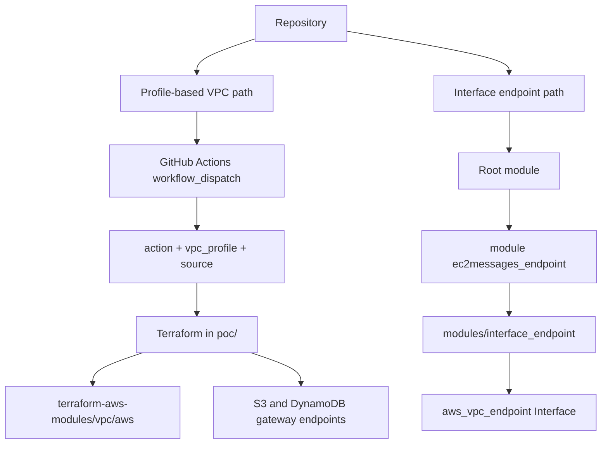
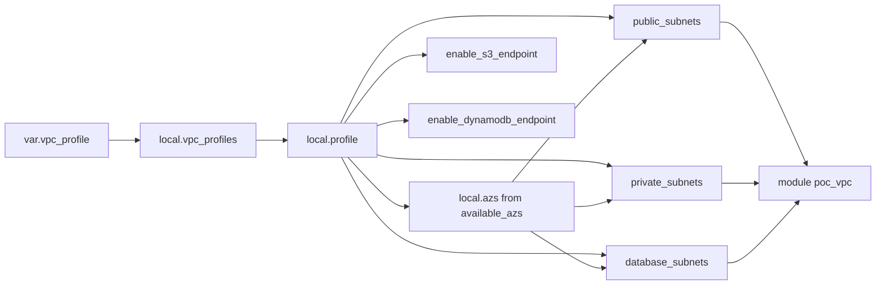

# vpce-ec2messages

A Terraform and GitHub Actions proof of concept for two closely related AWS networking goals:

1. building curated VPC topologies from a small set of operator-friendly profiles, and
2. creating interface VPC endpoints for private AWS service connectivity, especially `ec2messages`.

The repository started from the interface-endpoint use case and later expanded into a broader profile-driven VPC workflow. The result is a repo that documents both the **network foundation** and the **private service access pattern** that motivated it.

## Why this repo exists

The original motivation was an interface VPC endpoint for `ec2messages`, which AWS documents as part of the Systems Manager messaging API path used by managed instances [1]. AWS also documents interface VPC endpoints as the private connectivity mechanism for AWS services that expose endpoint ENIs in subnets with attached security groups and optional private DNS [2][3].

As the proof of concept evolved, the repository grew into a cleaner profile-based VPC workflow so that different subnet, NAT, DNS, and endpoint patterns could be tested with a simple manual GitHub Actions interface [4][5].

## Repository scope

This repository now covers two complementary infrastructure paths:

- **Profile-based VPC workflow** in `poc/`, driven by GitHub Actions and Terraform locals.
- **Reusable interface endpoint module** in `modules/interface_endpoint`, used for `ec2messages` and adaptable to similar services [6][7].

## Architecture



## Profile-based VPC workflow

The GitHub Actions workflow accepts three manual inputs:

- `action = plan | apply | destroy`
- `vpc_profile = minimal | development | production`
- `source` as optional trigger metadata

The workflow exports `TF_VAR_vpc_profile`, computes a profile-specific backend key, initializes Terraform in `poc/`, validates the configuration, and always performs a plan phase before any apply or destroy action [4][5].

### Workflow sequencing

```mermaid
sequenceDiagram
    actor User as Operator
    participant GH as GitHub Actions
    participant PLAN as plan job
    participant APPLY as apply job
    participant DESTROY as destroy job

    User->>GH: Run workflow_dispatch
    User->>GH: Select action, vpc_profile, source
    GH->>PLAN: Start plan job
    PLAN->>PLAN: Echo inputs
    PLAN->>PLAN: Compute backend key
    PLAN->>PLAN: terraform init
    PLAN->>PLAN: terraform validate
    PLAN->>PLAN: terraform plan or terraform plan -destroy
    alt action == apply
        GH->>APPLY: needs successful plan
        APPLY->>APPLY: terraform init
        APPLY->>APPLY: terraform apply
    else action == destroy
        GH->>DESTROY: needs successful plan
        DESTROY->>DESTROY: terraform init
        DESTROY->>DESTROY: terraform destroy
    else action == plan
        GH-->>User: End after plan
    end
```

### State isolation

The workflow dynamically sets the backend key to:

```text
vpc-endpoints/poc/<vpc_profile>/terraform.tfstate
```

This keeps Terraform state isolated per VPC profile.

## VPC profiles

The active profile is selected from a Terraform local map and translated into name, CIDR, AZ count, subnet flags, NAT settings, DNS settings, and endpoint enablement. Terraform locals are intended for reusable internal values and expression reuse, which makes them a good fit for this translation layer [8][9].

Terraform uses `cidrsubnet(prefix, newbits, netnum)` to derive subnet CIDRs from each profile CIDR, which allows the subnet structure to be generated programmatically instead of hardcoded [10].

### Implemented profile matrix

| Profile | CIDR | AZs | Public | Private | Database | NAT | DNS | Endpoint behavior |
|---------|------|-----|--------|---------|----------|-----|-----|-------------------|
| `minimal` | `10.10.0.0/16` | 1 | Yes | No | No | Disabled | Enabled | No endpoints |
| `development` | `10.20.0.0/16` | 2 | Yes | Yes | No | Single NAT gateway | Enabled | S3 gateway endpoint |
| `production` | `10.30.0.0/16` | 3 | Yes | Yes | Yes | NAT enabled with `single_nat_gateway = false` | Enabled | S3 and DynamoDB gateway endpoints |

### Profile translation flow



## VPC module implementation

The file `poc/vpc.tf` calls `terraform-aws-modules/vpc/aws` version `~> 5.0` and drives it directly from the derived locals. That includes the VPC name, VPC CIDR, AZ list, public/private/database subnet lists, NAT settings, DNS settings, `map_public_ip_on_launch`, and `create_database_subnet_group` [11][12].

The implementation also sets:

- `manage_default_network_acl = false`
- `manage_default_security_group = false`

That is a sensible scope choice for a POC because it avoids taking over AWS default constructs unnecessarily [13][14].

## Gateway endpoints

The profile-based VPC path creates S3 and DynamoDB endpoints as separate `aws_vpc_endpoint` resources rather than embedding them inside the VPC module.

Both endpoints are created as **Gateway** endpoints, and each is conditionally enabled through profile flags. AWS documents gateway endpoints for S3 and DynamoDB as route-table-associated private access paths that avoid the need for internet gateway or NAT traffic for those services [15][16][17].

The implementation associates these gateway endpoints with the concatenated public and private route table ID lists from the VPC module, which means both route table classes receive the gateway endpoint routes [16][17].

## Interface endpoint module

The repository also contains a local reusable module at `modules/interface_endpoint`.

A root module calls it like this for `ec2messages`:

```hcl
module "ec2messages_endpoint" {
  source = "../modules/interface_endpoint"

  enabled             = var.enabled
  name                = "ec2messages-interface-endpoint"
  vpc_id              = var.vpc_id
  service_name        = var.service_name
  subnet_ids          = var.subnet_ids
  security_group_ids  = var.security_group_ids
  private_dns_enabled = var.private_dns_enabled
  tags                = var.default_tags
}
```

Terraform module blocks are the standard mechanism for packaging reusable infrastructure logic [18][6].

### Interface endpoint behavior

Inside the child module, the endpoint resource is:

- `aws_vpc_endpoint.this`
- conditionally created using `count = var.enabled ? 1 : 0`
- configured as `vpc_endpoint_type = "Interface"`
- attached to explicit subnets and security groups
- optionally configured with private DNS
- tagged with merged caller-provided tags and a baseline `Name` / `ManagedBy` pair

This matches AWS guidance for interface endpoints, which centers on one subnet per Availability Zone, attached security groups, and private DNS behavior [2][3][7].

### Interface endpoint outputs

The child module exposes:

- `id`
- `dns_entry`
- `network_interface_ids`

Terraform outputs are intended to expose useful infrastructure values from a module or root configuration for inspection and downstream use [19][20].

## Provider and versions

The repo currently pins:

- Terraform CLI: `= 1.14.8`
- AWS provider: `~> 5.0`
- VPC module: `~> 5.0`

The GitHub Actions workflow also installs Terraform `1.14.8`, which keeps local configuration and CI aligned. Terraform version constraints and provider requirements are the standard mechanism for controlling compatibility and reproducibility [21][22].

The AWS provider is configured with:

- `region = var.aws_region`
- provider-level `default_tags`

The AWS provider supports `default_tags`, which helps enforce a consistent tagging baseline across resources [23][24].

## Outputs

The current root outputs for the profile-based VPC path are:

- `poc_vpc_id`
- `poc_vpc_profile`
- `poc_public_subnets`
- `poc_private_subnets`
- `poc_database_subnets`

These outputs provide a quick way to inspect the deployed topology after apply [19][20]
